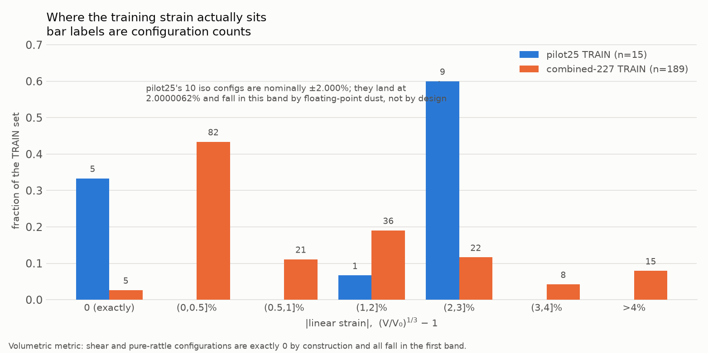

# The dilution hypothesis: REFUTED

**Question.** Does combined-227 lose to pilot25 on cfg107 (and similar
configurations) because the training signal that pilot25 carries in concentrated
form is *diluted* in the 189-configuration combined-227 TRAIN set?

**Verdict: REFUTED.** Not merely unsupported - the data point the other way on
every axis the hypothesis needs. Nothing was diluted: between pilot25 and
combined-227, Al3Ni's *share* of the training set went **up** (20.0% -> 28.6%),
its compression coverage went from **1 configuration at -2.0%** to **21
configurations reaching -4.8%**, and combined-227 holds a training configuration
at *exactly* cfg107's strain. The decisive test is in section 6: combined-227's
error at -4% Al3Ni compression is **the same on a configuration it trained on as
on the held-out one** (5.263 vs 5.243 meV/atom, ratio 0.996). Adding data to that
region buys nothing, so scarcity of data there cannot be what is wrong.

No model was trained for this. Everything below is a property of the datasets,
plus the already-computed Phase 3 evaluations in
`results/benchmark_per_structure.csv`.

## Metric

The project's own definition, recovered from
`results/distortion/error_vs_strain.csv` and reproduced to 2e-14:

```
lin_strain = (V/V0)^(1/3) - 1     signed; negative = compression
```

`V0` is the relaxed per-atom volume of that phase. Both datasets are measured
against the **same** reference cells - pilot25's own relaxed structures match
combined-227's relaxed volumes exactly (mismatch 0.000e+00 A^3/atom), so the
comparison is well posed.

*Limitation, stated up front:* the metric is purely volumetric. Volume-preserving
deformations - shear, pure rattle - are **exactly 0 by construction**. Twenty-two
of the 38 held-out configurations sit at exactly 0 under it and carry no strain
signal at all.

## 1. Distribution of |linear strain| across TRAIN



| band | pilot25 n (frac) | combined-227 n (frac) |
|---|---|---|
| 0 (exactly) | 5 (0.333) | 5 (0.026) |
| (0, 0.5]% | 0 (0.000) | 82 (0.434) |
| (0.5, 1]% | 0 (0.000) | 21 (0.111) |
| (1, 2]% | 1 (0.067) | 36 (0.190) |
| (2, 3]% | 9 (0.600) | 22 (0.116) |
| (3, 4]% | 0 (0.000) | 8 (0.042) |
| > 4% | 0 (0.000) | 15 (0.079) |

pilot25 TRAIN is not a distribution in any meaningful sense: it is **5 relaxed
structures and 10 iso configurations at nominally +-2%**, one per phase per sign.
Nothing else. combined-227 is a genuine spread with a heavy mass near zero.

## 2. Fraction above 2% strain - and why the naive number is a trap

pilot25's iso configurations were built as a nominal +-2.000% scaling, but land at
**2.0000062%** - a hair above 2, because the scaling was applied to a cell whose
relaxed volume is not exactly the reference. A naive `> 2` test therefore sweeps
9 of them into the high-strain bin and reports pilot25 as 60% high-strain. That
is floating-point dust, not a property of the dataset. Both readings:

| | pilot25 (n=15) | combined-227 (n=189) |
|---|---|---|
| fraction > 2% (naive `> 2.0`) | **0.600** (9) | **0.238** (45) |
| fraction > 2% (tolerance 1e-3) | **0.000** (0) | **0.175** (33) |
| fraction at or above 2% | 0.667 (10) | 0.254 (48) |
| mean \|strain\| | 1.333% | 1.200% |
| median \|strain\| | 2.000% | 0.503% |
| **max \|strain\|** | **2.000%** | **5.600%** |

**The honest reading is the tolerant one: pilot25 has zero configurations above
2% strain; combined-227 has 33.** The naive reading inverts the comparison
entirely and should never be quoted.

The one axis on which pilot25 is genuinely richer is *proportional density* near
the 2% shell (67% of its TRAIN against 25%). It is poorer on every axis of
*reach*: its training set stops dead at 2.0%, while combined-227 runs to 5.6%.

## 3. Al3Ni TRAIN by strain sign

| | pilot25 | combined-227 |
|---|---|---|
| Al3Ni TRAIN configurations | 3 | 54 |
| compression | 1 | 21 |
| expansion | 1 | 22 |
| volume-neutral | 1 | 11 |
| compression share of signed | 50% | 48.8% |
| mean \|strain\|, compression | 2.000% | 1.393% |
| mean \|strain\|, expansion | 2.000% | **3.033%** |
| \|strain\| > 2%: compression / expansion | 0 / 0 | **4 / 12** |
| max compression reached | **-2.0%** | **-4.8%** |

**The premise behind the question is confirmed.** Within combined-227's Al3Ni
TRAIN set, high-strain coverage really is expansion-skewed: at \|strain\| > 2%
there are 12 expansion configurations against 4 compression, and the expansion
side reaches +5.6% while compression stops at -4.8%. The remediation rounds did
target expansion.

**But it explains nothing**, because pilot25 - the model that wins - has *less*
compression data than combined-227 by every measure: one configuration instead of
21, stopping at -2.0% instead of -4.8%, and no volume-rattle compression at all.
cfg107 sits at **-4.0%**, twice outside pilot25's entire training range. A
mechanism in which combined-227 is starved of compression signal cannot explain a
win by a model that is starved of it far more severely.

## 4. The sign framing fails on its own terms

The two VALIDATION-18 configurations where pilot25 beats combined-227 are of
**opposite sign**:

| config | strain | family | pilot25 | combined-227 | ratio |
|---|---|---|---|---|---|
| cfg107_Al3Ni_volume_rattle_compression | **-4.000%** | volume_rattle | 0.702 | 5.243 | 7.5x |
| cfg115_Al3Ni_iso_expansion | **+5.300%** | iso | 1.785 | 3.594 | 2.0x |

Across the full held-out set (RESERVED-20 + VALIDATION-18), the largest
combined-227 loss is on an **expansion** configuration, in the region the
remediation rounds covered most densely:

| config | strain | pilot25 | combined-227 | ratio |
|---|---|---|---|---|
| **cfg043_Al3Ni_volume_rattle_expansion** | **+3.500%** | 0.023 | 1.826 | **78x** |
| cfg039_Al3Ni_biaxial_xy_expansion | **+0.798%** | 0.093 | 0.760 | **8.2x** |

cfg039 also kills the magnitude framing: an **8.2x** loss - larger than cfg107's
7.5x - at a strain of only **+0.8%**, deep inside the region combined-227 covers
most densely of all.

## 5. pilot25 is extrapolating, and still winning

Nearest combined-227 TRAIN neighbour in strain space, same phase:

| contested config | strain | nearest combined-227 TRAIN | gap | nearest pilot25 TRAIN | gap |
|---|---|---|---|---|---|
| cfg107 | -4.000% | cfg101_Al3Ni_iso_compression, -4.000% | **0.000 pp** | Al3Ni_iso_m02, -2.000% | 2.000 pp |
| cfg115 | +5.300% | cfg289_Al3Ni_iso_expansion, +5.000% | **0.300 pp** | Al3Ni_iso_p02, +2.000% | 3.300 pp |

combined-227 is *interpolating* both configurations - cfg115 is bracketed by
same-phase, same-family TRAIN configurations at +5.0% and +5.6%; cfg107 has an
exact strain twin in TRAIN. pilot25 is extrapolating 2.0x and 2.65x beyond the
outer edge of its training data. **The extrapolator wins.** A dilution mechanism
predicts the opposite ordering.

## 6. The decisive test

Same phase, same strain, one configuration trained on and one held out:

| | config | split | strain | combined-227 abs error |
|---|---|---|---|---|
| trained on | cfg101_Al3Ni_iso_compression | TRAIN | -4.000% | **5.263** meV/atom |
| held out | cfg107_Al3Ni_volume_rattle_compression | VALIDATION | -4.000% | **5.243** meV/atom |

**Ratio held-out / trained-on = 0.996.** Being in the training set is worth
nothing at -4% Al3Ni compression. Any dilution mechanism predicts a large gap
here - the whole claim is that the region is under-served by training data, which
requires that training data help. It does not.

The same conclusion from the other direction: **combined-227 cannot fit its own
Al3Ni training data.** 12 of its 54 Al3Ni TRAIN configurations exceed the locked
2.6183 meV/atom acceptance bar, the worst being cfg284 at -4.8% (**7.627**
meV/atom, ~3x the bar) and cfg101 at -4.0% (5.263). pilot25, with no Al3Ni data
beyond +-2% at all, gets cfg284 to **0.442**.

The errors are seed-consistent (cfg107: 5.243 / 5.981 / 6.163 across seeds
20260811 / 20260812 / 20260813), so none of this is seed noise.

## What replaces the hypothesis

The signed errors show combined-227 **overcorrecting** where the base model
undershoots:

| config | base MATPES-PBE-0 | pilot25 | combined-227 |
|---|---|---|---|
| cfg101 (TRAIN, -4.0%) | -16.433 | +0.849 | **+5.263** |
| cfg107 (held out, -4.0%) | -16.060 | +0.702 | **+5.243** |
| cfg284 (TRAIN, -4.8%) | -22.032 | -0.442 | **+7.627** |

The base model is badly wrong and negative; pilot25 lands near zero;
combined-227 overshoots to consistently positive. This is the signature of a
**systematic, seed-stable bias in combined-227's Al3Ni volumetric response at
\|strain\| >~ 3%** - a fitting failure that persists on data the model trained on,
not a coverage failure. More data in the region did not fix it and, on these
numbers, went past the target.

The discriminating variable is **phase**, not strain sign or magnitude:

| phase | held-out n | pilot25 wins | win rate |
|---|---|---|---|
| **Al3Ni** | 11 | 5 | **45%** |
| Al3Ni2 | 7 | 0 | 0% |
| Al3Ni5 | 8 | 1 | 13% |
| AlNi | 6 | 0 | 0% |
| AlNi3 | 6 | 2 | 33% |

Al3Ni against all others: 5/11 versus 3/27, Fisher exact **p = 0.031**.
Suggestive, not conclusive - with 38 configurations and 8 wins in total, one
flipped configuration moves it materially.

## What this analysis does NOT settle

- **Why pilot25 is better.** Refuting dilution does not supply the mechanism.
  The obvious guess - that pilot25 stays near the base model and so never
  acquires the bias - is *not* supported: pilot25 is far from base (0.702 against
  16.060 on cfg107). It is genuinely better there, and this analysis cannot say
  why. Settling it needs model-side work (LoRA weight-displacement analysis, or
  an ablation retrain), which is outside "data analysis only".
- **Whether the Al3Ni bias is a model-capacity limit or a DFT-consistency problem
  in the Al3Ni high-\|strain\| configurations themselves.** Both predict what is
  seen here.
- **Anything about volume-preserving deformations.** 22 of the 38 held-out
  configurations sit at exactly 0 strain under this metric, so more than half the
  held-out set is invisible to the strain axis entirely.

## Caveats

- pilot25's 15 TRAIN configurations are a **subset** of combined-227's 189, so
  the two sets are not independent draws.
- VALIDATION-18 is contaminated for this comparison: 5 of its members are
  pilot25's own early-stopping set. RESERVED-20 is the only set neither model
  trained on nor selected on, and the argument above is carried by RESERVED-20
  plus the TRAIN-versus-held-out test, not by VALIDATION-18 alone.
- The "fraction above 2%" comparison is knife-edge for pilot25 and flips
  direction under a 1e-3 tolerance. Section 2 gives both readings.

---

*Generated by `scripts/phase18_dilution.py`. Machine-readable form:
`results/dilution_hypothesis.json`. Per-configuration data:
`dilution_strain_per_config.csv`, `dilution_error_vs_strain_by_model.csv`,
`dilution_al3ni_train_strain.csv`, `dilution_strain_histogram.csv`.*
